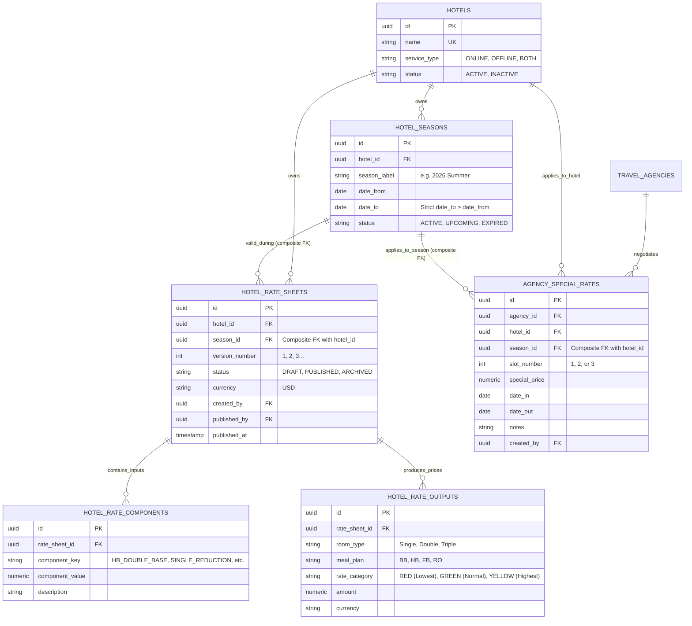

# WINDOW COMPANIES MANAGEMENT SYSTEM — RATE DATABASE ERD

**Date:** November 05, 2026  
**Scope:** Entity-Relationship Diagram for Hotel Rates & Special Rates  

```mermaid
erDiagram
    HOTELS ||--o{ HOTEL_SEASONS : "owns"
    HOTELS ||--o{ HOTEL_RATE_SHEETS : "owns"
    HOTEL_SEASONS ||--o{ HOTEL_RATE_SHEETS : "valid_during (composite FK)"
    
    HOTEL_RATE_SHEETS ||--o{ HOTEL_RATE_COMPONENTS : "contains_inputs"
    HOTEL_RATE_SHEETS ||--o{ HOTEL_RATE_OUTPUTS : "produces_prices"
    
    TRAVEL_AGENCIES ||--o{ AGENCY_SPECIAL_RATES : "negotiates"
    HOTELS ||--o{ AGENCY_SPECIAL_RATES : "applies_to_hotel"
    HOTEL_SEASONS ||--o{ AGENCY_SPECIAL_RATES : "applies_to_season (composite FK)"

    HOTELS {
        uuid id PK
        string name UK
        string service_type "ONLINE, OFFLINE, BOTH"
        string status "ACTIVE, INACTIVE"
    }

    HOTEL_SEASONS {
        uuid id PK
        uuid hotel_id FK
        string season_label "e.g. 2026 Summer"
        date date_from
        date date_to "Strict date_to > date_from"
        string status "ACTIVE, UPCOMING, EXPIRED"
    }

    HOTEL_RATE_SHEETS {
        uuid id PK
        uuid hotel_id FK
        uuid season_id FK "Composite FK with hotel_id"
        int version_number "1, 2, 3..."
        string status "DRAFT, PUBLISHED, ARCHIVED"
        string currency "USD"
        uuid created_by FK
        uuid published_by FK
        timestamp published_at
    }

    HOTEL_RATE_COMPONENTS {
        uuid id PK
        uuid rate_sheet_id FK
        string component_key "HB_DOUBLE_BASE, SINGLE_REDUCTION, etc."
        numeric component_value
        string description
    }

    HOTEL_RATE_OUTPUTS {
        uuid id PK
        uuid rate_sheet_id FK
        string room_type "Single, Double, Triple"
        string meal_plan "BB, HB, FB, RO"
        string rate_category "RED (Lowest), GREEN (Normal), YELLOW (Highest)"
        numeric amount
        string currency
    }

    AGENCY_SPECIAL_RATES {
        uuid id PK
        uuid agency_id FK
        uuid hotel_id FK
        uuid season_id FK "Composite FK with hotel_id"
        int slot_number "1, 2, or 3"
        numeric special_price
        date date_in
        date date_out
        string notes
        uuid created_by FK
    }
```

